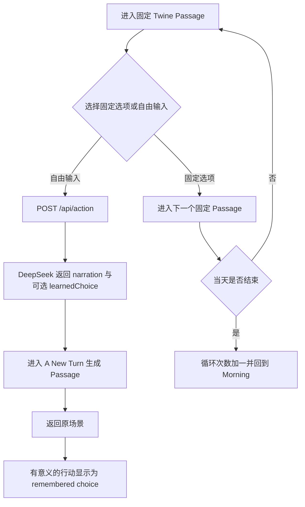

# 节点一实现说明

检查日期：2026-08-10

目标环境：Windows、本地浏览器、本地 Python 服务、DeepSeek API

## 1. 节点一目标

节点一验证一条最小但完整的交互叙事链路：

1. 玩家可以沿《狐狸与乌鸦》的固定 Twine 路径经历同一天。
2. 当天结束后故事回到相同的早晨，循环次数与狐狸的记忆提示保留。
3. 玩家可以在任意固定场景提交自然语言行动。
4. DeepSeek 为该行动生成当前场景中的即时后果。
5. 玩家输入和生成结果共同显示为新的 Twine Passage。
6. 有意义的行动可以成为该场景的 remembered choice，并在后续循环继续出现。

节点一只记录已经实现和验证的行为，不定义后续节点。

## 2. 当前玩家流程



提交成功后，输入框会清空。请求失败时仍停留在原场景并保留输入，便于玩家修改或重试。

## 3. Choice 晋升规则

DeepSeek 不再只保留“直接成功”的行动。满足以下任一条件的具体行动可以晋升：

- 改变角色态度或关系；
- 让角色或物品发生有意义的移动；
- 消耗或获得资源；
- 产生部分成功；
- 即使失败，也提供可复用的世界信息或角色信息。

以下输入不晋升：不是行动、与场景矛盾或不可能、完全没有有意义后果。

前端按规范化后的原始行动文本去重。Remembered choice 保存原始行动、简短标签和已知结果；点击后进入生成 Passage，并直接重放结果，不再次调用 API。

## 4. 前后端职责

| 组件 | 当前职责 |
|---|---|
| Twine / SugarCube | 固定故事、循环次数、自由输入、生成 Passage、remembered choice、当前游戏会话状态 |
| Python 本地服务 | 静态文件服务、请求验证、API Key 保管、Prompt 组装、DeepSeek 调用、错误转换 |
| DeepSeek | 生成即时叙事；判断行动是否有值得保留的后果；生成简短 choice label |
| 测试 | 验证后端契约、配置加载、状态规则和 Agent 提案边界，不消耗 API 额度 |

API Key 只存在于本地后端进程和被忽略的 `.env.local` 中，不会发送到浏览器或写入故事源码。

## 5. 实现位置

| 文件 | 作用 | 接入状态 |
|---|---|---|
| `src/story.twee` | 固定 Passage、界面样式、自由输入、生成 Passage、循环与 remembered choice | 已接入可玩流程 |
| `dist/index.html` | Tweego 编译后的可玩文件 | 已生成 |
| `backend/server.py` | 本地 HTTP 服务与 DeepSeek 代理 | 已接入可玩流程 |
| `backend/game_state.py` | 狐狸、乌鸦、关系、地点、物品、时间和循环的不可变状态规则 | 已实现并测试，尚未接入可玩流程 |
| `backend/action_resolution.py` | DeepSeek 状态结算提案的强类型协议与状态感知校验 | 已实现并测试，尚未接入可玩流程 |
| `tests/test_server.py` | HTTP 与 DeepSeek 请求契约测试 | 已验证 |
| `tests/test_game_state.py` | 时间、饥饿、友谊、所有权与循环重置测试 | 已验证 |
| `tests/test_action_resolution.py` | Agent effect 越权、越界和世界一致性测试 | 已验证 |

“已经存在代码”和“已经进入玩家流程”在本文中明确分开，避免把基础设施误报为可玩功能。

## 6. 已建立但尚未接入的状态基础

状态内核已经定义：

- 当天状态：狐狸、乌鸦、关系、地点、物品、剩余时间；
- 跨循环状态：循环次数、狐狸记忆、已学会行动、固定世界种子；
- 每个行动必须消耗正时间；
- 饥饿死亡优先于日终；
- 友谊需要信任、支持行为、乌鸦回馈且没有未解决背叛；
- 只有在当天结束时才根据友谊决定重置或脱离循环。

Agent 提案校验器已经限制模型只能提议命名 effect，例如移动角色、有限改变饥饿或信任、发现食物、转移或食用物品。模型不能直接设置友谊、死亡、循环重置或结局。

这些规则目前只有单元级直接证据，尚不能代表浏览器中的游戏已经使用结构化状态。

## 7. 运行方式

在项目根目录运行：

```powershell
& 'D:\ProgramData\Anaconda3\python.exe' .\backend\server.py
```

然后打开：

```text
http://127.0.0.1:8000
```

代码更新后需要停止旧服务、重新启动，并在浏览器执行强制刷新。停止服务使用 `Ctrl+C`。

## 8. 验证证据

```powershell
& '.\.tools\tweego-2.1.1\tweego.exe' -f sugarcube-2 -o '.\dist\index.html' '.\src'
& 'D:\ProgramData\Anaconda3\python.exe' -m unittest discover -s tests -v
```

截至 2026-08-10：

- 31 项 Python 测试通过；
- Tweego 构建通过；
- StoryScript JavaScript 语法检查通过；
- 真实 DeepSeek 请求通过；
- 浏览器验证了“自由输入 → 生成 Passage → 返回原场景 → 输入清空 → remembered choice”；
- 停止后端后，remembered choice 仍可进入 Passage 并重放结果，证明没有二次 API 请求。

## 9. 当前边界

- 结构化游戏状态和 Agent effect 尚未接入 `/api/action` 与 Twine。
- Remembered choice 保存于当前 SugarCube 游戏状态，刷新为新游戏后不保证保留。
- Remembered choice 当前重放已知结果，不会依据新的结构化状态重新结算。
- 固定故事路线仍是主要流程，自由行动不会创建持久的分支图。
- 本文不设计或承诺后续节点的具体内容。

## 10. 关联文档

- [项目 README](../README.md)
- [开发交付进度](development-progress.md)
- [Notion 文案整理流程](notion-documentation-workflow.md)
